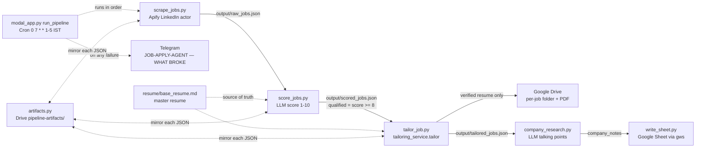

# Architecture

## Pipeline



Every stage is resume-safe and keyed by **canonical job link** (`scripts/job_links.py canonical_link`, tracking params
stripped): re-running a stage skips jobs already done. Artifacts are mirrored to Drive so a local run can finish a failed
Modal run (see `RUNBOOK.md`).

## Stage ownership

| Stage | File | Reads | Writes |
|---|---|---|---|
| Orchestration (cloud) | `modal_app.py` `run_pipeline` | Modal secrets | runs the 5 scripts as subprocesses with per-step timeouts; post-run reconciliation; Telegram alert |
| Orchestration (local) | `scripts/run_pipeline.py` | `.env` (`LOCAL_MODE=true`) | same 5 scripts in order |
| Scrape | `scripts/scrape_jobs.py` `scrape_jobs()` | Apify, `output/preferences.json` (optional) | `output/raw_jobs.json` (6h cache) |
| Score + filter | `scripts/score_jobs.py` `score_job()` | raw jobs, master resume | `output/scored_jobs.json` (qualified **and** rejected kept) |
| Tailor + verify + upload | `scripts/tailor_job.py` → `scripts/tailoring_service.py` `tailor()` | qualified jobs, master resume | Drive folder + PDF, `output/tailored_jobs.json`, `output/generated_resumes/<id>/` |
| Verification | `scripts/no_fabrication.py`, `scripts/validate_resume.py` | tailored text vs master | pass / problems |
| Export layout | `scripts/format_resume_doc.py`, `scripts/tailor_job.py` `render_markdown`/`export_doc_file` | resume markdown | Google Doc → PDF/DOCX |
| Company research | `scripts/company_research.py` | saved entries | `company_notes` in `tailored_jobs.json` |
| Tracker | `scripts/write_sheet.py` (+ `tracker_service.py` for the dashboard) | saved entries | Google Sheet rows (deduped by link) |
| LLM client | `scripts/llm.py` `call_llm` | provider keys | — |
| Dashboard | `scripts/dashboard_server.py` + `web/` | all of the above | see `docs/ui/` |

Dedupe today = canonical link only (scoring skips links already scored; tailoring skips `status: "saved"`; the Sheet
dedupes by link). There is **no** `(title, company)` dedupe in the code — see `TASKS.md` (planned multi-source work).

## Job dict schema (exact, from the code)

### 1. `output/raw_jobs.json` — list, from `scrape_jobs()`
| Key | Type | Source field (Apify item) |
|---|---|---|
| `title` | str | `title` |
| `company` | str | `companyName` or `company` |
| `link` | str | `link` or `jobUrl` or `url` |
| `description` | str | `descriptionText` or `description` |
| `posted_date` | str | `postedDate` or `postedAt` or `publishedAt` |
| `location` | str | `location` or `jobLocation` |
| `source` | str | always `"LinkedIn"` |
| `found_at` | str | `date.today().isoformat()` (YYYY-MM-DD) |

### 2. `output/scored_jobs.json` — raw job + (from `score_job()`)
| Key | Type | Notes |
|---|---|---|
| `score` | int 1-10 | from the LLM |
| `reasoning` | str | 1-3 sentences |
| `matched_must_haves` | list[str] | default `[]` |
| `missing_must_haves` | list[str] | default `[]` |
| `qualified` | bool | `score >= QUALIFY_CUTOFF` (8), computed in code |

A job whose scoring raises is **not** written (logged, retried next run). If every remaining job fails, the script
raises so the run alerts.

### 3. `output/tailored_jobs.json` — one entry per qualified job (keyed by canonical link)
Saved (`scripts/tailor_job.py`):
`{title, company, link, score, drive_folder_link, resume_link, status: "saved", tailored_at (ISO UTC)}`
plus `company_notes` (str) added by `company_research.py`.

Flagged: the scored job dict + `status: "flagged_validation_failed" | "flagged_error"` + `reason` (str). Flagged jobs are
retried on the next run; `modal_app.reconcile_qualified` raises (→ Telegram) if a qualified job has no saved resume.

### 4. Google Sheet row (`write_sheet.build_row`) — see `CONFIG.md` for the column layout.

### Dashboard resume record — `output/generated_resumes/<resume_id>/meta.json`
Created by `tailoring_service.tailor()` via `resume_store.create()`: source, job, analysis, match, provider, `dedupe_key`,
`master_version` (12-char SHA-1 of the master), versions with markdown + validation. TODO: confirm full field list
against `scripts/resume_store.py` if you need it.

## Subsystem reference

The detailed notes below were moved verbatim from the previous `CLAUDE.md` (2026-09-29) so nothing was lost when
`CLAUDE.md` was shortened.

### Pipeline (build in this order — each step's output feeds the next)

1. **Scrape** — Apify actor (free tier) for LinkedIn Full-Stack Software Engineer / Java Developer
   postings, remote/hybrid, full-time. Output: `{title, company, link, description, posted_date}`.
2. **Score + Filter** — score each job 1-10 against `resume/base_resume.md`, extracting
   `matched_must_haves`/`missing_must_haves` as part of the same call (no separate parse step).
   **Hard cutoff: only 8+ continues.** Log reject count alongside qualified count (e.g. "10
   scraped, 3 qualified") — this is the on-camera proof the filter works.
3. **Tailor Resume** (Skill: `.claude/skills/tailor-resume/SKILL.md`) — reorder/reword the base
   resume to mirror the job's language and keywords. **Never invent experience, employers, tools,
   or metrics.** Reorder and reword only.
4. **Validate** (Hook) — before a tailored resume is saved or logged, check required sections exist
   (Summary, Skills, Experience) and no placeholder text remains. On failure, do not write the row —
   flag it instead.
5. **Company Research** (`scripts/company_research.py`) — per qualifying job, one OpenRouter call
   returns 3-5 talking points about the company/role. This is a plain script, not a Claude Code
   subagent — a real subagent needs a live interactive session, which the Modal headless cron can't
   provide. Used for human context only, never written verbatim into the resume.
6. **Outputs**:
   - Google Sheet row per qualifying job: title, company, job link, fit score, resume path, status,
     timestamp.
   - Desktop folder (interactive path) or Drive folder (Modal path) per qualifying job:
     `Job Applications/{company}-{job-title-slug}/` on Desktop (all per-job folders nest under one
     `Job Applications` parent), containing the tailored resume. The Sheet row references this
     exact folder/file.
7. **Headless + Hosting** — the automated path (`scripts/tailor_job.py`, `scripts/company_research.py`)
   uses OpenRouter instead of live Claude reasoning, so it can run unattended without an Anthropic
   API key. Deployed as a Modal scheduled function (`@app.function(schedule=modal.Cron(...))`),
   once daily. Secrets (Apify key, OpenRouter key, Google creds, Telegram bot token) via Modal
   secrets — never committed.

### Folder Structure (as built)

```
job-apply-agent/
  CLAUDE.md
  PRD.md
  README.md
  GWS_SETUP.md
  .env.example
  .claude/skills/tailor-resume/SKILL.md
  .claude/hooks/resume_hook.py
  resume/base_resume.md
  scripts/
    scrape_jobs.py         # Apify
    score_jobs.py           # scores + extracts matched/missing requirements
    tailor_job.py            # automated tailoring path (free provider chain, for Modal)
    company_research.py
    write_sheet.py          # Google Sheets
    format_resume_doc.py     # markdown -> real Google Docs formatting
    validate_resume.py       # shared validation logic
    llm.py                    # provider-aware chat client: free cloud chain (Groq->OpenRouter->Gemini) or local Ollama
    resume_role.py            # fixed header (master's name + headline, same for every job); normalized job title -> export filename only
    contact.py                # RESUME_CONTACT_LINE (email/location) added at export only -- base resume is public
    artifacts.py              # best-effort Drive mirror of stage JSON, for cross-machine resume
    run_pipeline.py            # LOCAL_MODE=true entrypoint: same 5 scripts in order, local high-volume runs
    tailoring_service.py     # ONE shared tailor path (manual JD + scraped job): analyze -> match -> tailor_job.tailor_text -> verify
    master_resume.py         # Master Resume editor: base_resume.md <-> structured sections, field validation, atomic save (GET/PUT /api/master-resume)
    jd_analysis.py           # JD sanitising, LLM requirement extraction, code-verified match vs base resume
    no_fabrication.py        # verifier: rejects invented tech/employers/dates/numbers; reorder-only fallback lives in tailoring_service
    resume_store.py          # output/generated_resumes/<id>/ (versions, exports)
    tracker_service.py       # cached, failure-tolerant wrapper over write_sheet.py
    dashboard_data.py / dashboard_tasks.py / dashboard_server.py   # dashboard read models, background tasks, stdlib HTTP server
    activity.py / paths.py   # activity log (output/activity_log.jsonl), shared paths
    dashboard_auth.py         # username/password sign-in: PBKDF2 hashes, server-side sessions, login rate limiter; create_/reset_dashboard_password.py are the setup utilities
    logging_config.py / log_reader.py   # ONE logging setup (console->Modal logs + rotating files in output/logs) and the bounded /api/logs reader; never log secrets/JDs/resumes
  web/                       # dashboard SPA (plain ES modules, no build); web/tests = node --test
  tests/test_llm.py           # stdlib unittest: provider failover, 429/404/timeout/JSON handling, reconciliation
  output/                    # gitignored — raw/scored/tailored job data + .artifact_sync.json sidecar
  modal_app.py                # scheduled entrypoint
  .env                        # gitignored — Apify key, provider API keys, Google creds, Telegram bot token
```

### Scoring (built)

`scripts/score_jobs.py` scores each job in `output/raw_jobs.json` 1-10 against
`resume/base_resume.md` via one LLM call per job (through `scripts/llm.py`'s free-provider
chain — see "LLM provider + failure recovery" below), using an explicit
rubric (must-have skills weighted heaviest, then years-of-experience/seniority fit, then
nice-to-haves as a tiebreaker — see the `RUBRIC_PROMPT` constant in the script for exact wording).
The script applies the `score >= 8` cutoff in code, not via a model-declared verdict. Output is
`output/scored_jobs.json` — **both qualified and rejected jobs are kept**, with a `qualified` bool,
so reject counts stay auditable per the PRD's "log the reject count too" requirement.

### Tailoring + Sheet tracking (built)

`.claude/skills/tailor-resume/SKILL.md` tailors the resume per qualifying job (reorder/reword
only, no fabrication), gated by `.claude/hooks/resume_hook.py` (a `PreToolUse` hook that blocks
the write if required sections are missing or placeholder text remains), then builds a Google Doc
via `gws`, formats it with `scripts/format_resume_doc.py` (converts the markdown structure into
real bold headers/bullets/italics — **never use `gws docs +write`** with raw markdown text, it
inserts `#`/`##`/`-` as literal characters instead of formatting), exports to PDF into
`~/Desktop/{company}-{slug}/Akhil Dalali Resume.pdf`, and deletes the intermediate Doc.
`scripts/write_sheet.py` then logs each `status: "saved"` entry from `output/tailored_jobs.json` to
the "Job Application Tracker" Google Sheet (id cached in `.env` as `google_sheet_id`), deduped by
job link, with `Status` starting at `"Not Applied"` for manual tracking.

Two `gws` gotchas worth knowing: `files` is a sub-resource of `drive`, not top-level
(`gws drive files export/delete`, not `gws files ...`), and `--output` for `gws drive files export`
is sandboxed to the current directory — `cd` into the target folder and export with a relative
filename, an absolute path is rejected.

### LLM provider + failure recovery (built)

**Free only — no paid models, no OpenRouter credit, no billing-enabled fallback, ever.**
`scripts/llm.py` is a provider-aware client with two modes:

- **Cloud (Modal cron)** — a failover chain over independent free tiers, tried in
  `llm_provider_order` (default `groq,openrouter,gemini`), built from whichever API keys are
  present:
  1. **Groq** `openai/gpt-oss-120b` — primary. No credit card, no training on inputs,
     commercial use permitted, ~30 RPM / ~1K RPD.
  2. **OpenRouter** `google/gemma-4-26b-a4b-it:free` — `:free` only. Burst-throttled.
  3. **Gemini** `gemini-2.5-flash` — no card. *Google may train on free-tier data* → last
     resort, optional (omit `GEMINI_API_KEY` to skip).

  Per provider: 429 → backoff honoring `Retry-After` → retry → next provider; 404 (model
  delisted, e.g. the old `minimax/minimax-m2.7:free`) → skip immediately, no retries; 5xx /
  timeout / malformed-JSON → retry then next. All providers exhausted → `call_llm` raises →
  the step fails → Telegram alert. JSON mode is validated inside the client (tolerates
  fenced/prose-wrapped JSON) so a bad response fails over instead of corrupting an artifact.
  `llm_request_delay_seconds` (default 5s) spaces calls to avoid burst 429s.

- **Local (recovery / high-volume)** — set `llm_base_url` directly (older recovery convention),
  or `LOCAL_MODE=true` (defaults `llm_base_url` to `http://localhost:11434/v1` if unset). Single
  provider, no chain, **no cloud calls ever** — `validate_local_setup()` checks Ollama is
  reachable and the model is pulled at startup and fails loudly (naming the `ollama serve` /
  `ollama pull <model>` fix) rather than silently falling back to Groq/OpenRouter/Gemini. This is
  the Ollama path, run via `python3 scripts/run_pipeline.py` (or the individual scripts) with
  `LOCAL_MODE=true`. **Modal must never set `llm_base_url` or `LOCAL_MODE`** — `modal_app.py`
  refuses to run if `llm_base_url` is present, and also refuses if no provider key is configured
  (fail fast, before spending an Apify scrape).

Job count is also mode-dependent (`scripts/scrape_jobs.py`): cloud uses `JOB_LIMIT` (default 10,
sized to OpenRouter's shared ~50-req/day free-tier cap); local uses `LOCAL_JOB_LIMIT` (default
50 — no such cap applies to Ollama, the ceiling is local compute time). Never change the global
scrape default to 50; the two limits are independent and the Modal cron must keep processing 10.

Modal secret needs at least `GROQ_API_KEY` (plus optionally `GEMINI_API_KEY`);
`open_router_apikey` is still read for back-compat.

The pipeline is **resume-safe**, keyed by job link at every stage — identically whether driven by
`modal_app.py` (cloud) or `scripts/run_pipeline.py` (local): same artifacts, same Drive mirror,
same Sheet, so a job that fails on one path can be finished by the other without duplicating
Sheet rows or Drive folders:
- `score_jobs.py` skips links already in `output/scored_jobs.json` (incremental write).
- `tailor_job.py` skips jobs already `status:"saved"` in `output/tailored_jobs.json` — it does
  **not** re-tailor or re-create Drive folders for finished jobs.
- `company_research.py` skips jobs that already have `company_notes`.
- `write_sheet.py` dedupes by job link against the live Sheet, so it's safe to re-run.

`scripts/artifacts.py` mirrors the three stage JSON artifacts to a `pipeline-artifacts` Drive
subfolder (date-stamped, under `google_drive_folder_id`), best-effort. This is what lets a local
Ollama run pick up a failed Modal run's state. `PIPELINE_DATE=YYYY-MM-DD` targets an earlier day;
`artifact_sync=0` disables the mirror. `write_sheet.py` sheet-id priority: configured
`google_sheet_id` → Drive lookup by name → create. For Modal, `google_sheet_id` goes in the
`job-apply-agent-secrets` secret (no persistent `.env` in the container).

### Verification Per Step

- Scrape: returns N jobs with title, company, link, description.
- Score: every job has a numeric score; jobs below 8 are excluded from all downstream steps.
- Tailor: output resume has no placeholder text and passes the validation hook.
- Sheet: row count matches qualifying-job count; every row has a working job link and resume
  reference.
- Desktop: folder count matches qualifying-job count; each folder has exactly one resume file.
- Headless run: `claude -p` completes with the same output as the interactive run, restricted to
  the allowed tools.
- Modal: scheduled function deploys, manual trigger runs end to end, forced failure produces the
  named Telegram alert.

### Dashboard (built)

`python scripts/dashboard_server.py` serves `web/` plus a JSON API over the existing artifacts and
the tracker Sheet. Manual-JD and scraped-job tailoring both go through `tailoring_service.tailor_resume()` (-> `tailor()`);
the scheduled pipeline (`tailor_job.py` -> `verified_resume()`) calls the same `tailor()`, so only
verified resumes (or the reorder-only fallback) are ever exported to Drive
(`tailoring_service.is_current_master()` / `master_resume_current` flags resumes built from an older master)
(reusing `tailor_job.tailor_text`, `validate_resume.validate`, `llm.call_llm`). Hard rules still
apply: `no_fabrication.check_no_fabrication` gates every export and tracker save; the automated
pipeline's 8+ cutoff is untouched (human-initiated dashboard actions may go below it, with a UI
warning). Tests import `tests/fixtures.py` first, which disables `.env` loading.

**Master Resume page** (`web/js/pages/masterResume.js`, `/master-resume`). Edits `resume/base_resume.md` section
by section through `GET`/`PUT /api/master-resume` (`scripts/master_resume.py`): the UI sends structured sections plus
`expected_version`, never a path; the server validates each field, rejects email/phone (contact stays in
`RESUME_CONTACT_LINE`), keeps the public profile line as stored, serialises back to the canonical Markdown
(the real master round-trips byte-for-byte) and atomically rewrites only `paths.BASE_RESUME`. A save changes the
master version, so older tailored resumes show `master_resume_current: false`; nothing existing is rewritten.
**The hosted (Modal) dashboard is read-only for the master** -- `resume/` is baked into the image, so a write there
would be lost on restart and never reach the cron; edit locally, commit and redeploy.

**Resumes live in Google Drive, not local paths.** `scripts/drive_resumes.py` uploads each exported
PDF/DOCX (`{resume_id}-v{n}.{ext}`) to `google_drive_folder_id/{company}-{title-slug}/` through the
existing `gws` auth, idempotently (keyed by resume_id + version + format in the file's `appProperties`,
so retries reuse the file). The tracker's Resume column always gets the PDF's Drive URL;
`tracker_service.save_job` refuses a local path, and a failed upload blocks the row instead of falling
back. `output/generated_resumes/` stays as the local cache/download source.

### UI specifications (docs/ui/)

The dashboard UI (`web/`) is specified in `docs/ui/` — read the relevant file before any UI change:
`UI_DESIGN_SYSTEM.md` (tokens, the visual source of truth), `UI_ARCHITECTURE.md` (vanilla ES modules, no build step,
`h()` only, layers), `UI_COMPONENTS.md`, `UI_PAGES.md` + one spec per page (`UI_DASHBOARD`, `UI_JOBS`, `UI_TAILOR_RESUME`,
`UI_MASTER_RESUME`, `UI_APPLICATIONS`, `UI_JOB_TRACKER`, `UI_JOB_ALERTS`, `UI_SETTINGS`, `UI_LOGS`), `UI_RESPONSIVE.md`,
`UI_ACCESSIBILITY.md`, and `UI_IMPLEMENTATION.md` (how to change the UI safely + the checklist). UI work never changes API
contracts, auth, tailoring/no-fabrication, the master-resume rules, the 8+ cutoff, tracker, Drive, logging, Modal or cron,
and never shows invented data or features.

### Hosted dashboard, authentication and logging (built)

**Hosting.** `modal_app.py` has a second Modal function, `dashboard`, that runs the same
`scripts/dashboard_server.py` (UI from `web/` + `/api/*`) behind one HTTPS origin —
`https://akhildalali07--job-apply-agent-dashboard.modal.run`. No CORS, no separate API host; the frontend
only calls relative `/api/...`. It mounts the `job-apply-agent-dashboard` Volume at `/app/output`,
runs a single container (`max_containers=1`, scale-to-zero) and keeps background tasks in memory, so a
restart mid-task loses that task. **The daily cron (`run_pipeline`) is independent**: it never mounts that
Volume, never reads the dashboard secret and never needs a dashboard login — don't couple them.

**Authentication** (`scripts/dashboard_auth.py`). Username/password only; the old `DASHBOARD_TOKEN` is gone.
`DASHBOARD_USERNAME`, `DASHBOARD_PASSWORD_HASH` (PBKDF2-SHA256, 600k rounds) and `DASHBOARD_ALLOWED_HOSTS`
live in the Modal secret `job-apply-agent-dashboard-secrets`; the dashboard refuses to start without them.
Sessions are opaque server-side ids in an HttpOnly/SameSite=Strict (Secure on HTTPS) cookie, mirrored to the
Volume. Every `/api/*` route except `/api/auth`, `/api/auth/login` and `/api/auth/logout` is default-deny;
login is rate limited (in-memory, single container). No credentials configured == open on loopback only
(local dev). Never write a password, hash, session id or token into code, docs, logs or the frontend. Set or
change the password with `scripts/create_dashboard_password_hash.py` / `scripts/reset_dashboard_password.py`
(README: "Dashboard authentication").

**Logging** (`scripts/logging_config.py`). One setup for everything: stderr (Modal runtime logs) plus rotating
JSON files in `output/logs/`, with request/task/resume/job ids and secret redaction. Use
`get_logger("<component>")`, never `print()` for diagnostics, and never log prompts, JDs, resumes, request
bodies or credentials. `/api/logs` + the Logs page (`scripts/log_reader.py`) are authenticated, validated and
bounded. `scripts/activity.py` (the user-facing Recent Activity feed) is separate and unchanged.
